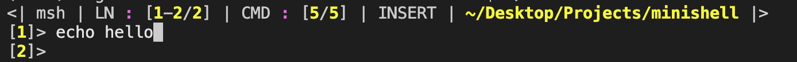
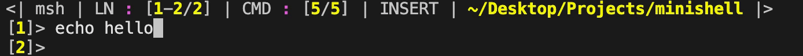
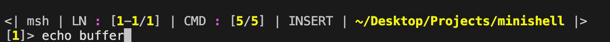
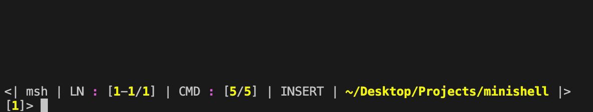
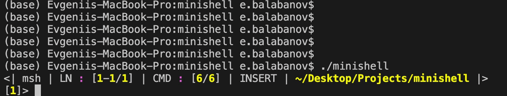

# Navigation
- [1. Start](#Start)
- [2. Modes](#Modes)
	- [2.1. Insert mode](##Insert-mode)
	- [2.2. Normal mode](##Normal-mode)
	- [2.3. Buffer mode](##Buffer-mode)
	- [2.4. Choice mode](##Choice-mode)
	- [2.5. Note mode](##Note-mode)
- [3. Modes commands](#Modes-commands)
- [4. Authors](#Authors)

# Start
Для открытия терминала

		msh

Запуск скриптов

		msh ./script.sh
---
---
# Modes

## Insert mode

Стандартный режим для изменения полей

---

## Normal mode

Режим для ввода встроеных команд

Перейти из режима Insert можно нажав "Escape"

---

## Buffer mode

Режим для изменения состояния буфера обмена

Перейти из режима Normal можно нажав сочетания клавиш "cb"

Выйти обратно сочетаниями клавиш "cm"

Режим поддерживает insert и normal в самом себе

---

## Choice mode

Вызывается в том случае, когда требуется сделать выбор

К примеру при табулиции, для того чтобы допонить слово

---

## Note mode

Режим для замещения редиректа "<<"

---
---

# Modes commands

|				|							|		Insert		|		Normal		|	Buffer_insert	|	Buffer_normal	|		Choise		|	  Note_insert	|	  Note_normal	|
| ------------- |:-------------------------:|:-----------------:|:-----------------:|:-----------------:|:-----------------:|:-----------------:|:-----------------:|:-----------------:|
|				|	**Вставить букву**		|		Any Key		|	 		-		|		Any Key		|		  -			|	 		-		|	  	Any Key		|		-			|
|				|	**Перенос строки**		|		-			|	"\\" + Enter	|		-			|	"\\" + Enter	|			-		|	     Enter		|	  	Enter		|
|	**Buffer**	|	**Очистить буффер**		|		-			|		"yd"		|					|					|					|					|					|
|				|	**Втавить буффер вниз**	|		-			|		"p"			|					|					|					|					|					|
|				|	**Втавить буффер вверх**|		-			|		"P"			|					|					|					|					|					|
|	**Comands**	|	**Удалить команду**		|		-			|		"cd"		|					|					|					|					|					|
|				|	**Левая команда**		|		-			|		"z"			|					|					|					|					|					|
|				|	**Влево на n команд**	|		-			|	digit + "z"		|					|					|					|					|					|
|				|	**Правая команда**		|		-			|		"x"			|					|					|					|					|					|
|				|	**Вправо на n команд**	|		-			|	digit + "x"		|					|					|					|					|					|
|				|	**Новая команда**		|		-			|		"cn"		|					|					|					|					|					|
|				|	**Завершение работы**	| 	Cntrl+"D"		|	Cntrl+"D"		|	Cntrl+"D"		|	Cntrl+"D"		|			-		|	Cntrl+"D"		|	Cntrl+"D"		|
|				|	****	||||||||
|				|	****	||||||||
|				|	****	||||||||
|				|	****	||||||||
|				|	****	||||||||
|				|	****	||||||||
|				|	****	||||||||
|				|	****	||||||||
|				|	****	||||||||
|				|	****	||||||||
|				|	****	||||||||
|				|	****	||||||||

---
---

# Authors

---

- Evgenii Balabanov https://github.com/EvgeniiBalabanov
- Oleg Lebedev		https://github.com/aberry-21
